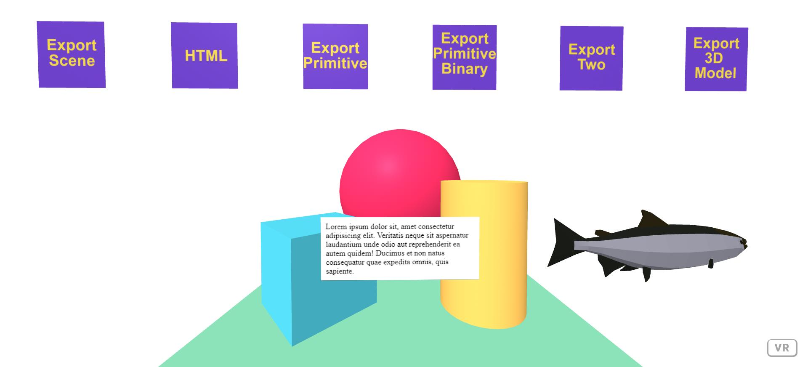

# AFrame GLTF Exporter (updated version)

### **Description / Rationale**
This is a small project, which demonstrates the working and updated version of AFrame GLTF Exporter Component, created by <a href="https://github.com/fernandojsg/aframe-gltf-exporter-component">Fernando Serrano</a>, which is compatible with AFrame ver 1.3. Unfortunately latest version of the component is old and not compatible. 
This project also demonstrates the major functionality of the component, which includes:
- Exporting simple primitives (GLTF)
- Exporting several primitives (GLTF)
- Exporting as binary file (GLB)
- Exporting 3D model (GLTF)
- Exporting HTML enabled through <a href="https://github.com/supereggbert/aframe-htmlembed-component">HTML embed Component</a> (GLTF).

### **Instructions**
To see the project at work just copy the repository to your local server and explore all the functionality. For reference, please see original <a href="https://github.com/fernandojsg/aframe-gltf-exporter-component">AFrame GLTF Exporter Component.</a>

### **Tech Stack**
The project is powered by AFrame.

### **Demo**
To see the application at work: [Demo application](https://gltf-exporter.glitch.me/)
